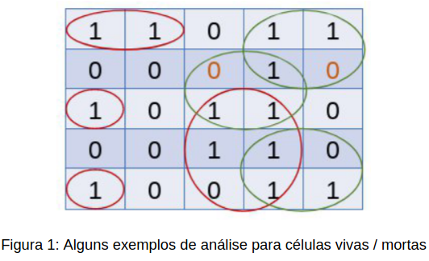
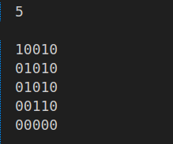
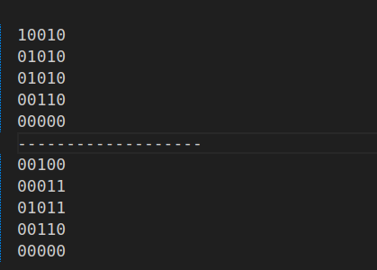

# Atividade 0: Trabalho de aquecimento

## Introdução
O objetivo principal deste trabalho é revisar e reforçar os conceitos de manipulação de matrizes, controle de fluxo e lógica de jogo proposto no laboratório da disciplina de Algoritmos e Estruturas de Dados I pelo professor Michel Pires Da Silva no CEFET-MG *campus* Divinópolis.

O trabalho é direcionado ao desenvolvimento do Jogo da Vida, um autômato celular que evolui de acordo com regras simples, mas gera padrões complexos. Ele é representado por uma matriz 2D de células, cada uma podendo estar viva ou morta.

## Desenvolvimento  

### Regras e Implementações:
1. Crie uma matriz N x N para representar o tabuleiro do Jogo da Vida.
2. Inicialize o tabuleiro com células vivas (1) e mortas (0) aleatoriamente.
3. Implemente uma função para exibir o estado atual do tabuleiro.
4. Implemente uma função para produzir um relatório de execução, guardando o histórico da evolução do jogo em arquivo.
5. Implemente uma função para calcular a próxima geração do Jogo da Vida com base nas seguintes regras:

    - Uma célula viva com menos de dois vizinhos vivos morre (solidão).
    - Uma célula viva com mais de três vizinhos vivos morre (superpopulação).
    - Uma célula viva com dois ou três vizinhos vivos sobrevive.
    - Uma célula morta com exatamente três vizinhos vivos se torna viva (reprodução).
6. Execute várias gerações do jogo e mostre o estado do tabuleiro após cada geração.

### Arquivos do Projeto e seus Fluxos
#### 1. datasets/input.mps 
Arquivo destinado para os dados da matriz de entrada.

Nesse arquivo encontra a matriz e sua dimensão:

    
    
Figura 2: Exemplo de entrada de uma matriz de 5x5

#### 2. datasets/geracoes.mps
Arquivo destinado para as gerações das matrizes.

    
    
Figura 3: Exemplo de saida de matrizes, do primeiro e a sua próxima geração

#### 3. arquivo.cpp e arquivo.hpp
São arquivos para manipulação dos dados de entrada e saída. Sendo o arquivo.hpp como a biblioteca das funções do arquivo.cpp.

Nesses arquivos estão contidas as seguintes variaveis e funções:

+ Variaveis:
    - string nome_input: Recebe o caminho do arquivo de entrada.
    - string nome_output: Recebe o caminho de saida.
    - Tabuleiro *novo_tabuleiro: Salva o matriz de entrada e das futuras gerações

+ Funções: 
    - **Arquivo(string nome_input, string nome_output)**: Construtor do Classe Arquivo e seus valores de entrada.

    - **void input()**: Onde ocorre a manipulação do arquivo de entrada, ler o tamanho e os dados da matriz e salva-os na variavel novo_tabuleiro. Tambem é responsavel por resolver algumas condições.

    - **void output()**: Ocorre a manipulação do arquivo de saida, onde ler a matriz atual e escreve no arquivo.

    - **Tabuleiro *getNovoTabuleiro()const**: Função responsavel por chamar a variavel novo_tabuleiro.

    - **void setTabuleiro(vector<short> tabuleiro)**: Função responsavel por transcrever a nova matriz na antiga.

    - **~Arquivo()**: Desconstrutor da classe.

#### 4. tabuleiro.cpp e tabuleiro.hpp
Responsavel por salvar os dados manipulados das matrizes. Sendo o tabuleiro.hpp como a biblioteca das funções do tabuleiro.cpp.

Nesses arquivos estão contidas as seguintes variaveis e funções: 

+ Variaveis: 
    - **short tamanho**: Responsavel por salvar o tamanho da matriz.
    - **vector<short> *tabuleiro**: Responsavel por salvar a matriz.
    
+ Funções: 
    - **Tabuleiro(short tamanho)**: Construtor do Classe Tabuleiro e seu valor de entrada.

    - **void print()**: Imprimi na tela a matriz atual.

    - **void setTabuleiro(vector<short> tabuleiro)**: Função responsavel por transcrever a nova matriz na antiga.

    - **vector<short> getTabuleiro() const** : Responsavel por chamar a variavel tabuleiro, onde se encontra a matriz.

    - **short getTamanho() const**: Responavel por chamar a variavel tamanho.

    - **~Tabuleiro()** : Desconstrutor da classe.

#### 5. jogo.cpp e jogo.hpp
Responsavel por manipular os dados da matriz de acordo as regras. Sendo o jogo.hpp como a biblioteca das funções do jogo.cpp.

Nesses arquivos estão contidas as seguintes variaveis e funções: 

+ Variaveis: 
    - **Arquivo *arquivo**: Responsavel por salvar os dados da classe Arquivo.

+ Funções: 
    - **Jogo()**: Construtor do Classe Jogo.
    - **void iniciarJogo()**: A única classe publica que é responsavel de começar o jogo. Nessa função, que ocorre a manipulção do arquivo.
    - **bool checarIgualdade(vector<short>tabuleiro, vector<short>sub_tabuleiro, short tamanho)**: checa se a nova geração é igual à anterior.
    - **void relatorio(const string& mensagem = "", Arquivo* arquivo = nullptr)**: Onde ocore a transferência dos dados de saidas, como a mostragem da matriz gerada e sua modificações e a chamada da função output.
    - **short verificacao(Tabuleiro *tabuleiro,  short posicao)**: Verifica quantos células vivas estão na borda de uma posição.
    - **~Jogo()**: Desconstrutor da classe.

#### 6. main.cpp
Arquivo responsavel de começar o Jogo da Vida.

### Compilação e Execução
O projeto disponibilizado possui um arquivo Makefile (disponibilizado pelo professor Michel) que realiza todo o procedimento de compilação e execução. Para tanto, temos as seguintes diretrizes de execução:

|Comando 	    |Função                                                                                  |
|---------------|----------------------------------------------------------------------------------------|
|make clean     |Apaga a última compilação realizada contida na pasta build                              |
|make 	        |Executa a compilação do programa utilizando o gcc, e o resultado vai para a pasta build |
|make run 	    |Executa o programa da pasta build após a realização da compilação                       |

